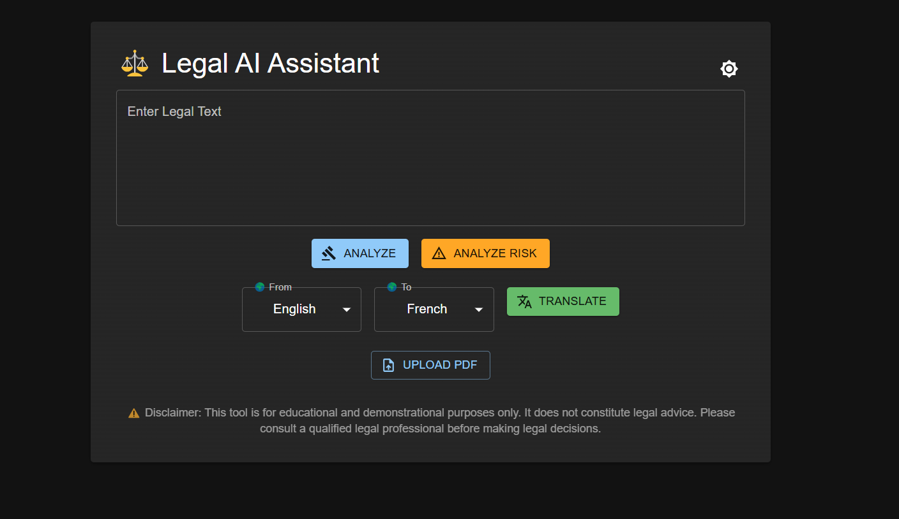

# ⚖️ Legal AI Assistant

An open-source, AI-powered tool to **analyze**, **summarize**, **detect risks**, and **translate** legal documents and contracts. Built using React, Node.js, and HuggingFace Transformers.

---

## 🌐 Live Project

- **Frontend:** [legal-ai-assistant.vercel.app](https://legal-ai-assistant-rho.vercel.app/)

---

## 🧠 Features

- 🔍 **Clause Detection** — Identifies key legal clauses like Termination, Payment, Liability, etc.
- 🧾 **AI Summarization** — Condenses lengthy legal content into clear summaries.
- ⚠️ **Risk Analysis** — Flags potential risks based on contract language.
- 🌍 **Translation** — Translates legal text into 6+ languages.
- 📄 **PDF Upload** — Extract and analyze multi-page legal documents.
- 🌓 **Dark Mode** — Toggle between light and dark themes.

---

## 🛠️ Tech Stack

| Frontend | Backend | AI Models (via HuggingFace) |
|----------|---------|-----------------------------|
| React.js + MUI | Node.js + Express | `facebook/bart-large-cnn` (Summarization) |
| Axios + Vercel | Multer + Render | `facebook/mbart-large-50-mmt` (Translation) |

---

## 🔐 Environment & Security

- All API keys and tokens are managed securely using `.env` files.
- Sensitive data like HuggingFace tokens are **not committed** to GitHub.

---

## 👨‍💻 Creator

**Aryan Gupta**  
🔗 [LinkedIn](https://www.linkedin.com/in/aryan-gupta-029a50248/)

---

## ⭐ Support

If this project helped you, show some love by giving it a ⭐ on GitHub and sharing it with your network!

---

## ⚠️ Disclaimer
This project is intended for educational and demonstrational purposes only. It does not constitute legal advice and should not be relied upon for any legal decisions. Always consult with a qualified legal professional before taking any action based on the output of this tool.

---

 
